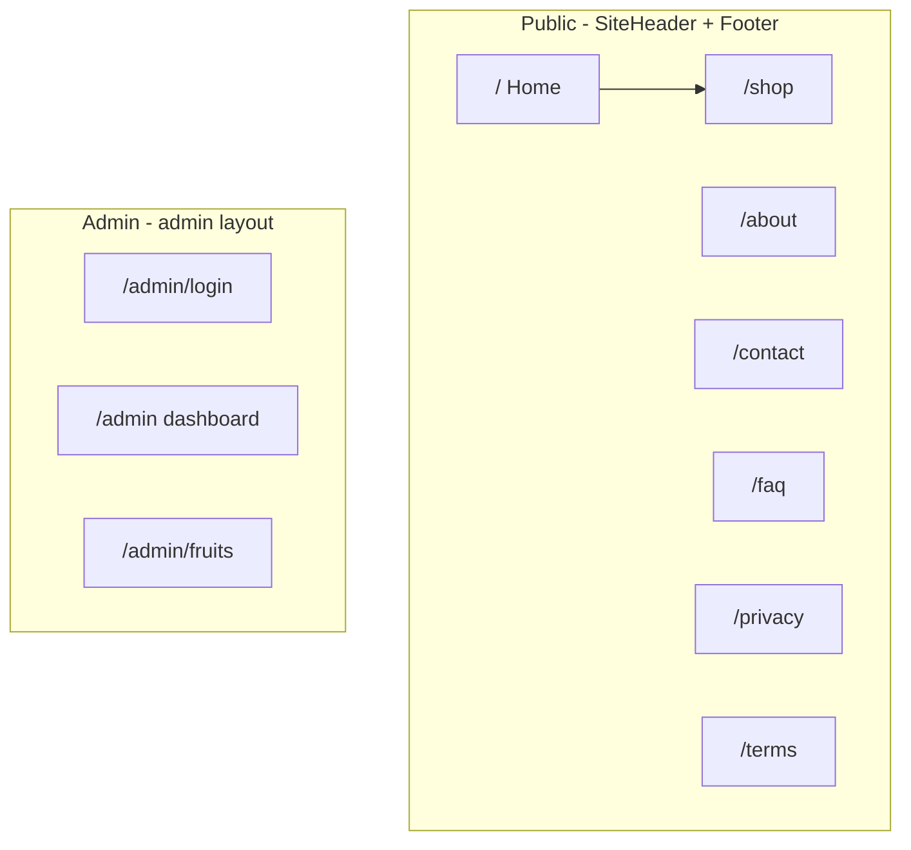

# UI layout map (for humans + AI)

Use this doc when talking to Cursor or ChatGPT about the storefront. Prefer **URLs + file paths** so we stay aligned.

---

## Words to use in prompts

| You say… | We map to… |
|-----------|-------------|
| “Top bar”, “global nav” | **`SiteHeader`** in `components/SiteHeader.tsx` (sticky; mobile menu inside) |
| “Bottom”, “footer” | **`Footer`** in `components/Footer.tsx` |
| “Skip link”, “a11y jump” | **Skip → `#main-content`** in `app/layout.tsx` |
| “Home hero” | **`HeroSection`** on `app/page.tsx` |
| “Shop grid / cart drawer” | **`app/shop/page.tsx`**; **`CartSidebar`** mounted once in **`CartProvider`** (`components/CartProvider.tsx`) |
| “Header cart”, “mini cart” | **`SiteHeader`** — **Cart** control **after Shop** opens global cart |
| “Admin shell” | **`app/admin/layout.tsx`** (login excluded from gate) |

**Brand names in UI:** header/footer use **Mango Tango Farm**; legacy “Seasonal Fruit Farm” text may exist in metadata—say which screen if reporting copy drift.

---

## Global shell (every public page)

```text
┌─────────────────────────────────────────────────────────┐
│ TrafficLogger (invisible), Skip link → #main-content     │
│ SiteHeader · logo · nav: Home About Shop **[Cart]** FAQ Contact │
├─────────────────────────────────────────────────────────┤
│                    <main id="main-content">               │
│                    (page-specific content)               │
├─────────────────────────────────────────────────────────┤
│ Footer · nav · contact · legal · social                  │
└─────────────────────────────────────────────────────────┘
```

**Root layout:** `app/layout.tsx` (wraps site in **`CartProvider`** for header cart + **`CartSidebar`**).  
**Design tokens:** `app/globals.css` (cream/charcoal, Poppins headings, `.btn-primary`, etc.)

---

## Site map (routes → files)

### Customer-facing (`app/`…)

| URL | Page file | Rough purpose |
|-----|-------------|----------------|
| `/` | `app/page.tsx` | Hero → featured mango grid → story → values → seasonal highlight → testimonials → newsletter |
| `/shop` | `app/shop/page.tsx` | Filters, mango grid images, **`CartSidebar`** checkout entry |
| `/about` | `app/about/page.tsx` | Farm story |
| `/contact` | `app/contact/page.tsx` | Contact + server actions (`app/actions/contactForm.ts`) |
| `/faq` | `app/faq/page.tsx` | FAQ accordion |
| `/privacy` | `app/privacy/page.tsx` | Privacy policy |
| `/terms` | `app/terms/page.tsx` | Terms |
| **`/demo/*`** | `app/demo/**` | Design experiments (optional; not primary nav) |

**System routes:** `app/not-found.tsx`, `app/global-error.tsx`, `app/robots.ts`, `app/sitemap.ts`

### Admin (separate UI chrome)

Uses **`app/admin/layout.tsx`** — own top nav, **no** public `Footer`/`SiteHeader` from root for those segments (nested under root `<html>/<body>` but layout replaces chrome for admin children).

| URL | Page file |
|-----|------------|
| `/admin/login` | `app/admin/login/page.tsx` |
| `/admin` | `app/admin/page.tsx` |
| `/admin/fruits` | `app/admin/fruits/page.tsx` |

---

## High-value components (mention by filename)

| Area | Components (under `components/`) |
|------|--------------------------------|
| Marketing home | `HeroSection`, `ProductCard`, `StoryBeat`, `ValueProposition`, `SeasonalHighlight`, `TestimonialCard`, `NewsletterSignup` |
| Shop | `CartSidebar`, list/grid built in page (Images + buttons) |
| Catalog data (browser) | `lib/mangoes.ts` (+ fallback `lib/mangoCatalogFallback.ts`) |
| Server / checkout / admin actions | `app/actions/*.ts` |

---

## Mermaid — route graph (mental model)



---

## Prompt templates you can paste

1. **Screen + goal:**  
   *“On **`/shop`** (`app/shop/page.tsx`), change [X]. Keep **`CartSidebar`** behavior.”*

2. **Global chrome:**  
   *“Update **`SiteHeader`** only: add link to…”*

3. **Copy/design:**  
   *“Hero on **`/`** (`HeroSection`): new headline…”*

4. **Bug:**  
   *“Broken on **`/admin/fruits`** after deploy: error says … (`adminFruits.ts`).”*

---

## Related docs

- Feature phases & checklists: **`docs/PLAN.md`**
- Supabase / traffic setup: **`docs/PART2_SETUP.md`** and **`docs/migrations/`**
